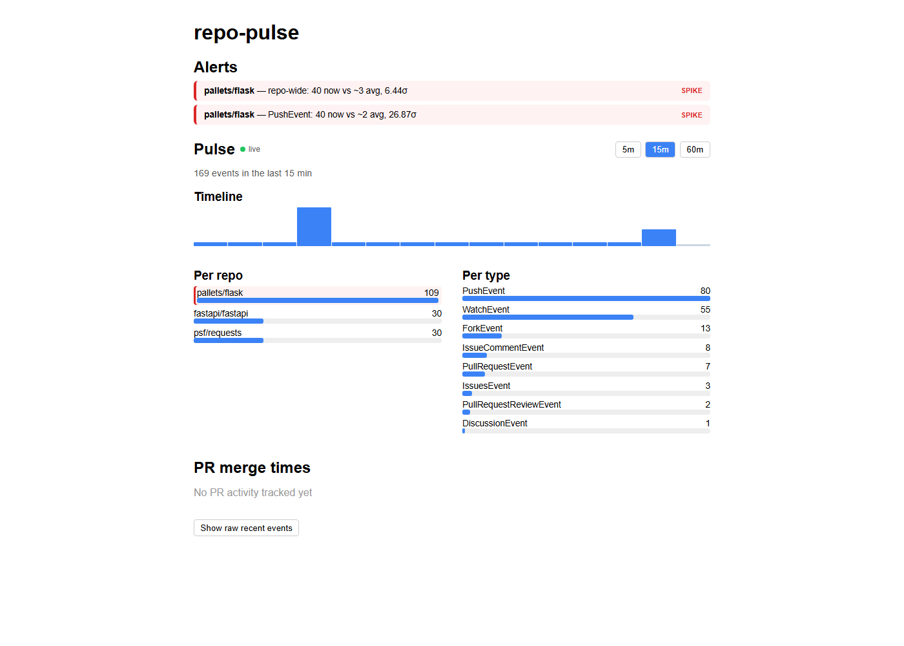

# repo-pulse

A real-time analytics pipeline for GitHub activity. It watches a set of public
repositories, ingests their event streams continuously, aggregates the activity
into live time-windowed metrics, tracks pull-request lifecycles, and raises
statistical alerts when a repo's behavior breaks out of its normal range — all
streamed to a live dashboard over WebSockets.

It's built to answer a different question than a static code analyzer: not "how
is this repo structured?" but "what is this repo *doing right now*, and is that
normal?"



*A synthetic velocity spike detected live: `pallets/flask` at 40 events/min
against a ~3/min baseline — 13.33σ out — surfaced as a SPIKE alert at the top of
the dashboard, with the affected repo highlighted.*

---

## What it does

- **Ingests** GitHub events (commits, PRs, issues, stars, forks, reviews) for a
  configurable set of watched repos, continuously and politely (conditional
  requests, rate-limit aware).
- **Streams** every event through Redis Streams with at-least-once delivery, so
  a consumer crash loses nothing.
- **Aggregates** activity into per-minute buckets and serves live windowed
  rollups (5 / 15 / 60 min) per repo and per event type.
- **Tracks PR lifecycles** — open→merge durations, with median/p90 percentiles.
- **Pushes** all of this to the browser over a WebSocket, coalesced so bursts
  don't overwhelm the client, with automatic reconnection.
- **Detects anomalies** — flags velocity spikes and activity stalls using a
  rolling statistical baseline, and raises them as live alerts.

---

## Architecture

A polyglot pipeline, with the language boundary placed where the workload
boundary is:

```
GitHub Events API
      |  (Go — concurrent pollers, ETag conditional requests, rate-limit aware)
      v
  Redis Streams
      |  (Python consumer group — XREADGROUP + XACK,
      |   at-least-once, resumable across restarts)
      v
  Aggregation  +  PR lifecycle  +  Anomaly detection
  (per-minute buckets, sorted sets, rolling mean +/- N-sigma)
      |
      v
  WebSocket  -->  React dashboard (live, auto-reconnecting)
```

- **`/ingest` (Go)** — the hot path. One goroutine per watched repo polling the
  GitHub Events API, publishing normalized events to a Redis Stream.
- **`/api` (Python / FastAPI)** — the consumer + web layer. Reads the stream via
  a consumer group, aggregates, detects anomalies, and serves the dashboard over
  both REST and WebSocket.
- **`/frontend` (React / Vite)** — the live dashboard.
- **Redis** — the stream broker and the durable store for aggregates and state.

**Why Go for ingest, Python for processing?** The ingest path is I/O-bound
network work under rate limits with per-repo concurrency — Go's model fits it
directly. The processing layer is data-shaped work (windowing, statistics) where
Python's ecosystem is stronger. The polyglot split lands on the natural seam in
the problem rather than being polyglot for its own sake.

---

## The engineering decisions worth calling out

**At-least-once delivery via Redis consumer groups.** The consumer reads with
`XREADGROUP` and only `XACK`s a message *after* it's fully processed. Redis holds
delivered-but-unacked messages in a Pending Entries List, so on a crash-restart
the consumer drains its pending list first and resumes exactly where it left
off — no lost events, no double-processing of acked ones. (Demo: kill the API
container mid-stream and watch it recover its pending work on restart.)

**Polite GitHub ingestion.** The Go poller sends the `ETag` from each response
back as `If-None-Match`; GitHub replies `304 Not Modified` when nothing changed,
and a 304 doesn't count against the rate limit — so polling a quiet repo is
nearly free. It also honors `X-RateLimit-Remaining` / `Poll-Interval` and backs
off rather than hammering. Events are deduplicated by ID (GitHub redelivers on
overlapping polls).

**Redis Streams over Kafka — deliberately.** At single-node scale, Redis Streams
gives the same delivery semantics that matter here (append-only log, consumer
groups, offsets, acknowledgment) with a fraction of the operational weight.
Kafka would be resume-driven overhead. Knowing when *not* to reach for the heavy
tool is part of the design.

**Coalesced WebSocket push with fan-out.** Rather than firehosing one message
per event (a burst of ~90 events on startup would stutter the client), the
server buffers events and flushes a batched update on a fixed interval. One
computed update is fanned out to every connected client. The client fully
replaces polling with the socket, and auto-reconnects with exponential backoff —
so a dropped connection (sleep, network blip, server restart) self-heals without
a reload.

**Statistical, explainable anomaly detection — not ML.** A rolling mean +/- N
sigma over the per-minute buckets, with three deliberate noise guards: a warm-up
period (no alerts until enough baseline exists), an absolute floor (ignore
tiny 0->2 blips), and a cooldown (don't re-fire the same alert every tick). The
formula is trivial; making it *not* cry wolf is where the work is. It's simple,
tunable, and explainable — every alert says exactly why it fired (`40 now vs ~3
avg, 13.33 sigma`).

**Honest about the data source.** Two metrics carry inherent limitations, and
the tool surfaces them rather than hiding them:
- PR merge times only cover PRs whose *entire* open->merge lifecycle happened
  during the watch window — GitHub's Events API only exposes ~300 events / 90
  days per repo, so a PR opened earlier shows as "unmatched," not as a
  fabricated duration.
- Anomaly detection needs a baseline, so for the first ~30 minutes it reports
  "warming up" rather than flagging everything as unusual.

---

## Running it

Requirements: Docker (Compose), and a GitHub personal access token with
public-repo read scope.

```bash
# 1. Configure the ingest service
cp ingest/.env.example ingest/.env
# edit ingest/.env — set GITHUB_TOKEN and WATCHED_REPOS
#   GITHUB_TOKEN=...
#   WATCHED_REPOS=pallets/flask,psf/requests,fastapi/fastapi

# 2. Bring the whole stack up
docker compose up --build
```

- Dashboard: http://localhost:4173
- API: http://localhost:8000
- Redis: localhost:6379

A GitHub token is required (unauthenticated polling is capped at 60 requests/hr;
authenticated is 5,000/hr). Pick active repos so there's activity to see.

---

## API

REST (also useful for debugging; the dashboard is driven by the WebSocket):

- `GET /health` — liveness.
- `GET /stats?window={5,15,60}` — windowed counts per repo and per event type,
  plus a per-minute timeline.
- `GET /stats/pr` — PR lifecycle metrics (median/p90 merge time, merged count,
  open PRs tracked, unmatched merges).
- `GET /anomalies` — current active anomalies + warm-up status.
- `GET /stream/health` — consumer-group diagnostics (stream length, pending/
  unacked count).
- `GET /events/recent` — the most recent normalized events.

WebSocket:

- `WS /ws` — sends a full snapshot on connect, then coalesced `update` messages
  (stats + PR + recent events) on a fixed interval, plus `anomaly` messages when
  signals fire.

---

## Tech stack

- **Ingest:** Go (stdlib `net/http`, `go-redis`)
- **API / processing:** Python, FastAPI, `redis-py` (async)
- **Frontend:** React, Vite (hand-rolled charts, no chart lib)
- **Broker / store:** Redis (Streams + consumer groups + sorted sets)
- **Infra:** Docker Compose

---

## Testing

```bash
cd api
pytest -q
```

Covers URL validation, windowed aggregation and bucket math, PR-lifecycle
tracking and percentile math, consumer-group behavior, the WebSocket connection
manager and coalescer, and anomaly detection (spike flagging, noise/warm-up/
floor guards, the divide-by-zero guard on a flat baseline, activity-stall, and
cooldown). External calls (GitHub, real Redis) are faked in tests — no network.